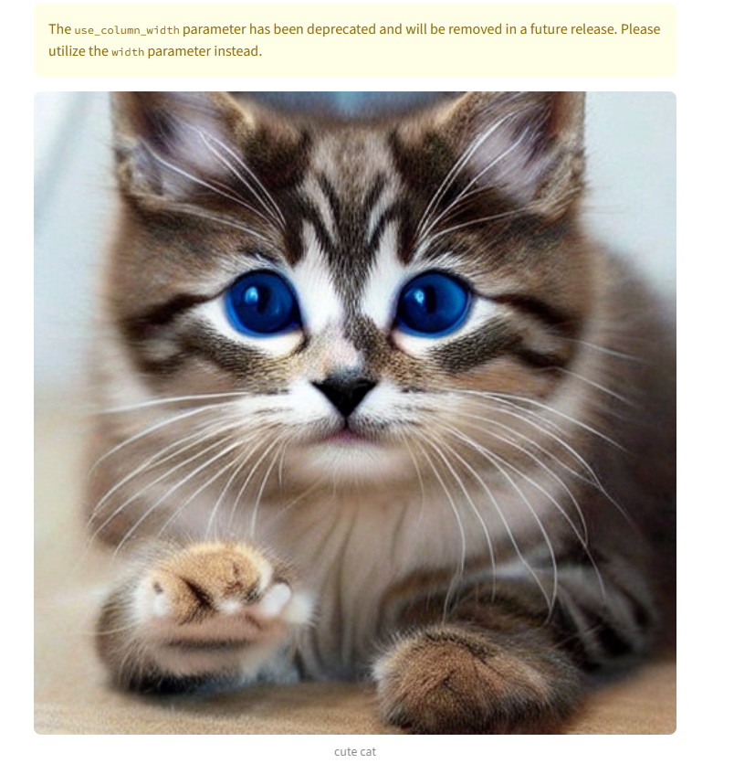
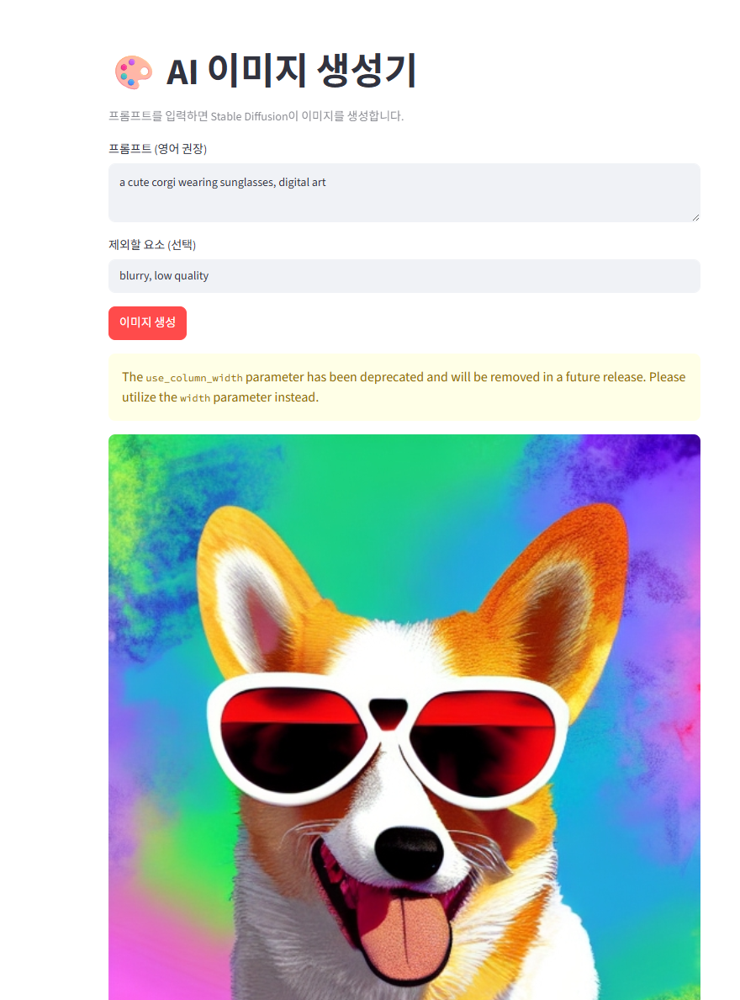

모델 배포 개론 08  
Last modified : 2026.03   
작성 : 박광성 (모두의연구소)  
수정 : 김지성 (모두의연구소)  


```python
# 서버 실행 도우미 — 노트북 맨 처음에 한 번 실행하세요.
# 노트북 안에서 uvicorn 서버를 띄우고 멈추는 함수를 정의합니다.
import os, sys, asyncio, threading, time, socket, contextlib
import uvicorn

# 작업 디렉터리를 app/ 가 있는 위치로 맞춥니다 (notebooks/ 안에서 열어도 동작).
if not os.path.isdir('app') and os.path.basename(os.getcwd()) == 'notebooks':
    os.chdir('..')
# 코드를 저장할 폴더를 미리 만들어 둡니다.
for _d in ('app', 'models', 'data', 'frontend'):
    os.makedirs(_d, exist_ok=True)

_SERVERS = {}  # port -> (server, thread)

def _port_open(host, port):
    with contextlib.closing(socket.socket()) as s:
        s.settimeout(0.5)
        return s.connect_ex((host, port)) == 0

def stop_server(port=8000):
    """실행 중인 서버를 멈춥니다."""
    entry = _SERVERS.pop(port, None)
    if not entry:
        return
    server, thread = entry
    server.should_exit = True
    for _ in range(50):
        if not thread.is_alive():
            break
        time.sleep(0.1)

def serve_in_thread(app, host='127.0.0.1', port=8000, log_level='warning'):
    """백그라운드에서 uvicorn 서버를 띄웁니다.

    app: FastAPI 객체 또는 'app.main:app' 같은 import 경로.
    같은 포트에 서버가 이미 있으면 먼저 멈추고 새로 띄웁니다.
    """
    stop_server(port)
    if _port_open(host, port):
        print(f'⚠️ 포트 {port}를 다른 프로세스가 사용 중입니다 (다른 노트북의 서버일 가능성).')
        print('   그 노트북에서 stop_server(8000)을 실행하거나 커널을 종료한 뒤, 이 셀을 다시 실행하세요.')
        return None
    if isinstance(app, str):
        sys.modules.pop(app.split(':')[0], None)   # 파일을 다시 저장한 경우 최신 내용 반영
    for _ in range(50):
        if not _port_open(host, port):
            break
        time.sleep(0.1)
    config = uvicorn.Config(app, host=host, port=port, log_level=log_level, loop='asyncio')
    server = uvicorn.Server(config)
    server.install_signal_handlers = lambda: None
    def _run():
        # Windows는 SelectorEventLoop, 그 외는 기본 이벤트 루프를 사용합니다.
        if sys.platform == 'win32':
            loop = asyncio.SelectorEventLoop()
        else:
            loop = asyncio.new_event_loop()
        asyncio.set_event_loop(loop)
        loop.run_until_complete(server.serve())
    thread = threading.Thread(target=_run, daemon=True)
    thread.start()
    _SERVERS[port] = (server, thread)
    # 모델 로드 때문에 기동이 느릴 수 있다 — 최대 5분 대기 (첫 실행은 다운로드 포함)
    for i in range(600):
        if _port_open(host, port):
            print(f'서버 실행됨: http://{host}:{port}')
            return server
        if not thread.is_alive():
            print('서버 스레드가 종료됐습니다. 위 로그를 확인하세요.')
            return server
        if i > 0 and i % 20 == 0:
            print(f'  ... 모델 로드 중 ({i//2}초 경과)')
        time.sleep(0.5)
    print('5분 내에 서버가 시작되지 않았습니다. 위 로그를 확인하세요.')
    return server

print('서버 도우미 준비 완료 (serve_in_thread, stop_server)')
```

    서버 도우미 준비 완료 (serve_in_thread, stop_server)


# Day 8 — 자율 프로젝트: 나만의 모델 서빙 서비스 만들기

---

> **오늘의 목표**
>
> Day 1~7에서 배운 기술을 조합하여, 본인이 관심 있는 도메인의 모델을 서빙하는 서비스를 직접 만듭니다.  
> 따라하기가 아닌, **스스로 설계하고 구현하는** 첫 경험입니다.

---


## 1. 프로젝트 요구사항

---

### 1.1 조건

Day 5(주택 가격 예측)와 Day 6~7(이미지 분류 / 챗봇)에서 만든 서비스와 **동일한 구조**를 기본 베이스로 합니다. 

```
필수 구현 항목:

1. FastAPI 백엔드
   - 추론 엔드포인트 (POST /predict)
   - Pydantic으로 입력 검증
   - 비동기 추론 (run_in_executor)

2. API Key 인증
   - Day 6의 auth.py 재사용

3. Streamlit 프론트엔드
   - 사용자 입력 → API 호출 → 결과 표시

4. 에러 처리
   - 잘못된 입력, 모델 에러 시 적절한 HTTP 상태 코드 반환
```


### 1.2 제한 사항

```
하지 않는 것:

- 모델 학습 (사전학습 모델을 가져다 씁니다)
- Docker 패키징 (MLOps 과정에서 다룹니다)
- 데이터베이스 연동
```


### 1.3 평가 기준

```
✅ 서버가 정상적으로 실행되는가?
✅ Swagger UI에서 추론이 동작하는가?
✅ API Key 없이 요청하면 401이 반환되는가?
✅ 잘못된 입력에 대해 적절한 에러 메시지가 나오는가?
✅ Streamlit UI에서 입력 → 결과 확인이 가능한가?
```

---

## 2. 모델 선택 가이드

---

### 2.1 Hugging Face에서 모델 찾기

[Hugging Face Models](https://huggingface.co/models)에서 사전학습 모델을 선택합니다.
모델 학습은 하지 않고, `from_pretrained()`으로 바로 사용할 수 있는 모델을 고릅니다.

**모델 선택 시 확인할 것:**

```
1. 태스크가 명확한가? (text-classification, image-classification, summarization 등)
2. 한국어를 지원하는가? (필수는 아니지만, 데모가 직관적입니다)
3. 모델 크기가 적당한가? (CPU 환경이면 500MB 이하를 권장합니다)
4. pipeline()으로 바로 사용 가능한가?
```


### 2.2 도메인별 추천 예시

아래는 예시일 뿐입니다. **본인이 관심 있는 도메인을 자유롭게 선택하세요.**

| 도메인 | 태스크 | 추천 모델 (예시) |
|---|---|---|
| 감정 분석 | `text-classification` | `snunlp/KR-FinBert-SC` |
| 뉴스 분류 | `text-classification` | 원하는 분류 모델 |
| 텍스트 요약 | `summarization` | `eenzeenee/t5-base-korean` |
| 번역 | `translation` | `Helsinki-NLP` 시리즈 |
| 이미지 분류 | `image-classification` | `google/vit-base-patch16` |
| 객체 탐지 | `object-detection` | `facebook/detr-resnet-50` |
| 질의 응답 | `question-answering` | 원하는 QA 모델 |


### 2.3 모델 동작 확인

모델을 선택했으면, **서버 코드를 작성하기 전에** 노트북에서 먼저 동작을 확인합니다.


```python
# 예시: 텍스트 감정 분석
from transformers import pipeline

# 본인이 선택한 모델로 교체하세요
classifier = pipeline("text-classification", model="snunlp/KR-FinBert-SC")

result = classifier("오늘 주가가 크게 올랐습니다")
print(result)
# [{'label': 'positive', 'score': 0.95}]
```

    /workspace/venv/lib/python3.12/site-packages/tqdm/auto.py:21: TqdmWarning: IProgress not found. Please update jupyter and ipywidgets. See https://ipywidgets.readthedocs.io/en/stable/user_install.html
      from .autonotebook import tqdm as notebook_tqdm
    Warning: You are sending unauthenticated requests to the HF Hub. Please set a HF_TOKEN to enable higher rate limits and faster downloads.
    Loading weights: 100%|██████████| 201/201 [00:00<00:00, 30079.03it/s]


    [{'label': 'positive', 'score': 0.9987346529960632}]


예시 코드입니다. 샘플 이미지 파일이 있어야 실행됩니다.

```python
# 예시: 이미지 분류
from transformers import pipeline

classifier = pipeline("image-classification", model="google/vit-base-patch16-224")

result = classifier("test_image.jpg")
print(result)
# [{'label': 'tabby cat', 'score': 0.82}, ...]
```

> **이 셀이 정상 동작하면**, 서버 코드 작성으로 넘어갑니다.
> 여기서 에러가 나면, 모델을 바꾸거나 입력 형식을 확인하세요.


---

## 3. 프로젝트 뼈대 코드

---


### 3.1 폴더 구조


```python
import os

dirs = ["app", "models", "frontend"]
for d in dirs:
    os.makedirs(d, exist_ok=True)

print("프로젝트 구조:")
print("""
my-project/
├── 📁 app/
│   ├── auth.py              ← Day 6에서 만든 것 그대로 재사용
│   ├── schemas.py           ← 입력/출력 스키마 정의 (직접 작성)
│   ├── model_service.py     ← 모델 로드 + 추론 함수 (직접 작성)
│   └── main.py              ← FastAPI 서버 (직접 작성)
│
├── 📁 frontend/
│   └── app.py               ← Streamlit UI (직접 작성)
│
└── requirements.txt
""")
```

    프로젝트 구조:
    
    my-project/
    ├── 📁 app/
    │   ├── auth.py              ← Day 6에서 만든 것 그대로 재사용
    │   ├── schemas.py           ← 입력/출력 스키마 정의 (직접 작성)
    │   ├── model_service.py     ← 모델 로드 + 추론 함수 (직접 작성)
    │   └── main.py              ← FastAPI 서버 (직접 작성)
    │
    ├── 📁 frontend/
    │   └── app.py               ← Streamlit UI (직접 작성)
    │
    └── requirements.txt
    


### 3.2 auth.py — 재사용


```python
%%writefile app/auth.py
"""
Day 6에서 만든 인증 모듈을 그대로 재사용합니다.
"""
from fastapi import HTTPException, Header

VALID_API_KEYS = {
    "test-key-001": "사용자A",
    "test-key-002": "사용자B",
}


async def verify_api_key(x_api_key: str = Header(None)) -> str:
    if x_api_key is None:
        raise HTTPException(
            status_code=401,
            detail="API Key가 필요합니다. X-API-Key 헤더를 포함해 주세요.",
        )
    if x_api_key not in VALID_API_KEYS:
        raise HTTPException(
            status_code=401,
            detail="유효하지 않은 API Key입니다.",
        )
    return VALID_API_KEYS[x_api_key]
```

    Overwriting app/auth.py


### 3.3 schemas.py — 직접 작성


```python
%%writefile app/schemas.py
"""
입력/출력 스키마를 정의하세요.

참고: Day 2 섹션 4 (Pydantic 기초), Day 5 섹션 3 (HousingRequest)

TODO:
  - 본인의 모델 입력에 맞는 Request 스키마를 정의하세요.
  - 모델 출력에 맞는 Response 스키마를 정의하세요.
  - 필수 필드와 선택 필드를 구분하세요.
  - 적절한 검증 규칙(타입, 범위, 길이 등)을 추가하세요.

예시 (텍스트 분류의 경우):
  class PredictRequest(BaseModel):
      text: str = Field(..., min_length=1, max_length=5000)

  class PredictResponse(BaseModel):
      success: bool
      label: str
      confidence: float
"""
from pydantic import BaseModel, Field

# ── 여기에 작성하세요 ──────────────────────────
from pydantic import BaseModel, Field


class GenerateRequest(BaseModel):
    prompt: str = Field(..., min_length=1, max_length=500)
    negative_prompt: str = Field(default="", max_length=500)
    num_inference_steps: int = Field(default=30, ge=10, le=50)
    guidance_scale: float = Field(default=7.5, ge=1.0, le=20.0)


class GenerateResponse(BaseModel):
    success: bool
    image_base64: str
    prompt: str
    steps: int
    user: str
```

    Overwriting app/schemas.py


### 3.4 model_service.py — 직접 작성


```python
%%writefile app/model_service.py
"""
모델 로드와 추론 함수를 정의하세요.

참고: Day 1 섹션 5 (모델 로드), Day 5 섹션 2 (HousingPredictor)

TODO:
  1. load_model(): 모델을 로드하여 반환합니다.
     - transformers의 pipeline() 또는 from_pretrained()을 사용합니다.
     - 섹션 2.3에서 확인한 코드를 여기에 옮기면 됩니다.

  2. predict(model, input_data): 입력을 받아 추론 결과를 반환합니다.
     - 입력 전처리가 필요하면 여기서 합니다.
     - 결과를 dict로 반환합니다.

예시 (텍스트 분류의 경우):
  def load_model():
      return pipeline("text-classification", model="모델이름")

  def predict(model, text: str) -> dict:
      result = model(text)
      return {"label": result[0]["label"], "confidence": result[0]["score"]}
"""

# ── 여기에 작성하세요 ──────────────────────────
import io
import base64
import torch
from diffusers import StableDiffusionPipeline

MODEL_ID = "runwayml/stable-diffusion-v1-5"


def load_model():
    device = "cuda" if torch.cuda.is_available() else "cpu"
    dtype = torch.float16 if device == "cuda" else torch.float32
    pipe = StableDiffusionPipeline.from_pretrained(MODEL_ID, torch_dtype=dtype)
    pipe = pipe.to(device)
    pipe.enable_attention_slicing()
    print(f"모델 로드 완료 ({device})")
    return pipe


def predict(model, req) -> dict:
    image = model(
        prompt=req.prompt,
        negative_prompt=req.negative_prompt or None,
        num_inference_steps=req.num_inference_steps,
        guidance_scale=req.guidance_scale,
    ).images[0]
    buf = io.BytesIO()
    image.save(buf, format="PNG")
    img_b64 = base64.b64encode(buf.getvalue()).decode("utf-8")
    return {"image_base64": img_b64, "prompt": req.prompt, "steps": req.num_inference_steps}
```

    Overwriting app/model_service.py


### 3.5 main.py — 직접 작성


```python
%%writefile app/main.py
"""
FastAPI 서버를 정의하세요.

참고: Day 5 섹션 3 (housing_api.py), Day 6 섹션 6 (image_api.py)

TODO:
  1. FastAPI 앱 생성
  2. startup 이벤트에서 모델 로드
  3. GET /health 엔드포인트
  4. POST /predict 엔드포인트
     - Pydantic 스키마로 입력 검증
     - Depends(verify_api_key)로 인증 적용
     - run_in_executor로 비동기 추론

필수 import:
  import asyncio
  from concurrent.futures import ThreadPoolExecutor
  from fastapi import FastAPI, Depends, HTTPException
  from app.auth import verify_api_key
  from app.schemas import PredictRequest, PredictResponse  (본인이 정의한 이름)
  from app.model_service import load_model, predict
"""

# ── 여기에 작성하세요 ──────────────────────────
import asyncio
from concurrent.futures import ThreadPoolExecutor
from fastapi import FastAPI, Depends, HTTPException

from app.auth import verify_api_key
from app.schemas import GenerateRequest, GenerateResponse
from app.model_service import load_model, predict

app = FastAPI(title="이미지 생성 서비스", version="1.0.0")

inference_executor = ThreadPoolExecutor(max_workers=1)
MODEL = None


@app.on_event("startup")
def startup():
    global MODEL
    MODEL = load_model()


@app.get("/health")
async def health():
    return {"status": "ok", "model_loaded": MODEL is not None}


@app.post("/generate", response_model=GenerateResponse)
async def generate(request: GenerateRequest, user: str = Depends(verify_api_key)):
    if MODEL is None:
        raise HTTPException(status_code=503, detail="모델이 아직 준비되지 않았습니다.")
    try:
        loop = asyncio.get_event_loop()
        result = await loop.run_in_executor(inference_executor, predict, MODEL, request)
    except Exception as e:
        raise HTTPException(status_code=500, detail=f"이미지 생성 실패: {e}")
    return GenerateResponse(
        success=True,
        image_base64=result["image_base64"],
        prompt=result["prompt"],
        steps=result["steps"],
        user=user,
    )
```

    Overwriting app/main.py


### 3.6 frontend/app.py — 직접 작성


```python
%%writefile frontend/app.py
"""
Streamlit 프론트엔드를 정의하세요.

참고: Day 4 섹션 6 (대시보드), Day 5 섹션 4 (주택 가격 UI)

TODO:
  1. st.title()로 제목
  2. 사이드바에 API Key 입력
  3. 본인의 모델에 맞는 입력 위젯 (text_input, file_uploader 등)
  4. 버튼 클릭 시 requests.post()로 API 호출
  5. 결과 표시

실행 방법:
  streamlit run frontend/app.py
"""
import streamlit as st
import requests

# ── 여기에 작성하세요 ──────────────────────────
import base64, io
from PIL import Image

API_URL = "http://localhost:8000/generate"

st.set_page_config(page_title="AI 이미지 생성기", page_icon="🎨", layout="centered")
st.title("🎨 AI 이미지 생성기")
st.caption("프롬프트를 입력하면 Stable Diffusion이 이미지를 생성합니다.")

with st.sidebar:
    st.header("설정")
    api_key = st.text_input("API Key", value="test-key-001", type="password")
    st.divider()
    steps = st.slider("추론 스텝 (품질↔속도)", 10, 50, 30)
    guidance = st.slider("프롬프트 충실도", 1.0, 20.0, 7.5)

prompt = st.text_area("프롬프트 (영어 권장)",
                      value="a cute corgi wearing sunglasses, digital art", height=80)
negative = st.text_input("제외할 요소 (선택)", value="blurry, low quality")

if st.button("이미지 생성", type="primary"):
    if not prompt.strip():
        st.warning("프롬프트를 입력해 주세요.")
    else:
        with st.spinner("이미지 생성 중... (수십 초 걸릴 수 있어요)"):
            try:
                resp = requests.post(
                    API_URL, headers={"X-API-Key": api_key},
                    json={"prompt": prompt, "negative_prompt": negative,
                          "num_inference_steps": steps, "guidance_scale": guidance},
                    timeout=180)
                if resp.status_code == 200:
                    data = resp.json()
                    img_bytes = base64.b64decode(data["image_base64"])
                    st.image(Image.open(io.BytesIO(img_bytes)), caption=data["prompt"],
                             use_column_width=True)
                    st.success(f"생성 완료! (요청자: {data['user']}, 스텝: {data['steps']})")
                    st.download_button("이미지 다운로드", data=img_bytes,
                                       file_name="generated.png", mime="image/png")
                elif resp.status_code == 401:
                    st.error("인증 실패: API Key가 올바르지 않습니다.")
                elif resp.status_code == 422:
                    st.error(f"입력 오류: {resp.json()['detail']}")
                else:
                    st.error(f"오류 ({resp.status_code}): {resp.text}")
            except requests.exceptions.ConnectionError:
                st.error("서버에 연결할 수 없습니다. FastAPI 서버(:8000)가 켜져 있나요?")
            except Exception as e:
                st.error(f"요청 실패: {e}")
```

    Overwriting frontend/app.py


---

## 4. 작업 시간

---

### 4.1 권장 순서


```
Step 1. 모델 선택 + 노트북에서 동작 확인 (섹션 2.3)
        → "이 모델이 내 입력에 대해 결과를 반환하는가?"

Step 2. schemas.py 작성
        → "입력과 출력의 형태를 정의"

Step 3. model_service.py 작성
        → "모델 로드 + 추론 함수"

Step 4. main.py 작성
        → "FastAPI 서버 조립"

Step 5. 서버 실행 + Swagger UI 테스트
        → "API가 동작하는가?"

Step 6. frontend/app.py 작성
        → "Streamlit UI 연결"
```


### 4.2 서버 실행 (Step 5에서 사용)

> ⚠️ **코드를 수정했는데 반영이 안 될 때 — 커널을 재시작하세요.**
>
> `app/main.py`, `app/model_service.py` 등을 고친 뒤 아래 셀을 다시 실행해도,
> 이미 메모리에 올라간 이전 코드가 남아 변경이 반영되지 않을 수 있습니다.
> 코드를 수정했다면 **커널 재시작(Kernel → Restart) 후 맨 위 셀부터 다시 실행**하세요.


```python
import requests, base64, io
from PIL import Image
from IPython.display import display

r = requests.post(
    "http://127.0.0.1:8000/generate",
    headers={"X-API-Key": "test-key-001"},
    json={"prompt": "a cute corgi wearing sunglasses, digital art",
          "negative_prompt": "blurry", "num_inference_steps": 30, "guidance_scale": 7.5},
    timeout=180,
)
print("상태코드:", r.status_code)
if r.status_code == 200:
    img = Image.open(io.BytesIO(base64.b64decode(r.json()["image_base64"])))
    display(img)
else:
    print(r.text)
```

    100%|██████████| 30/30 [00:01<00:00, 15.57it/s]


    상태코드: 200


    

    


```python
# 서버 실행 (같은 포트에 서버가 떠 있으면 자동으로 멈추고 새로 띄웁니다)
serve_in_thread("app.main:app", port=8000)
```

      ... 모델 로드 중 (10초 경과)


    Fetching 15 files:   7%|▋         | 1/15 [00:00<00:04,  2.94it/s]

      ... 모델 로드 중 (20초 경과)
      ... 모델 로드 중 (30초 경과)


    Fetching 15 files:  27%|██▋       | 4/15 [00:28<01:23,  7.63s/it]

      ... 모델 로드 중 (40초 경과)


    Fetching 15 files: 100%|██████████| 15/15 [00:32<00:00,  2.19s/it]
    Loading weights: 100%|██████████| 196/196 [00:00<00:00, 3670.75it/s]5.52s/it]
    Loading pipeline components...:  57%|█████▋    | 4/7 [00:05<00:03,  1.11s/it]

      ... 모델 로드 중 (50초 경과)
      ... 모델 로드 중 (60초 경과)
      ... 모델 로드 중 (70초 경과)


    Loading weights: 100%|██████████| 396/396 [00:00<00:00, 1868.82it/s]7.44s/it]
    Loading pipeline components...: 100%|██████████| 7/7 [00:30<00:00,  4.30s/it]


    모델 로드 완료 (cuda)
    서버 실행됨: http://127.0.0.1:8000


    <uvicorn.server.Server at 0x7a7a0cbda090>


### 4.3 API 테스트 템플릿 (Step 5에서 사용)


```python
# API Key 없이 → 401
r = requests.post("http://127.0.0.1:8000/generate", json={"prompt": "test"}, timeout=10)
print("키 없음:", r.status_code, "(401이면 정상)")

# 빈 프롬프트 → 422
r = requests.post("http://127.0.0.1:8000/generate",
                  headers={"X-API-Key": "test-key-001"}, json={"prompt": ""}, timeout=10)
print("빈 프롬프트:", r.status_code, "(422면 정상)")
```

    키 없음: 401 (401이면 정상)
    빈 프롬프트: 422 (422면 정상)


    100%|██████████| 30/30 [00:01<00:00, 22.42it/s]
    100%|██████████| 30/30 [00:01<00:00, 21.68it/s]
    100%|██████████| 30/30 [00:01<00:00, 21.17it/s]
    100%|██████████| 30/30 [00:01<00:00, 21.39it/s]


```python
import requests

API_URL = "http://localhost:8000"
HEADERS = {"X-API-Key": "test-key-001"}

# health check
print(requests.get(f"{API_URL}/health").json())

# 추론 테스트 — 본인의 입력에 맞게 수정하세요
response = requests.post(
    f"{API_URL}/predict",
    json={"여기에": "본인의 입력"},   # ← 수정
    headers=HEADERS,
)
print(f"상태: {response.status_code}")
print(f"결과: {response.json()}")
```

    {'status': 'ok', 'model_loaded': True}
    상태: 404
    결과: {'detail': 'Not Found'}


### 4.4 막혔을 때 참고할 Day


```
"스키마를 어떻게 정의하지?"        → Day 2 섹션 4, Day 5 섹션 3
"FastAPI 서버 구조가 기억 안 나"   → Day 5 섹션 3, Day 6 섹션 6
"run_in_executor 사용법?"         → Day 3 섹션 4
"인증 적용 방법?"                  → Day 6 섹션 2
"Streamlit에서 API 호출?"         → Day 4 섹션 6, Day 5 섹션 4
"에러 처리?"                      → Day 3 섹션 5
```

---

## 5. 발표 및 회고

---

### 5.1 발표 (개인당 5분)

```
발표 항목:
  1. 어떤 도메인/태스크를 선택했는가?
  2. 어떤 모델을 사용했는가? (선택 이유)
  3. 데모 시연 (Swagger UI 또는 Streamlit)
  4. 구현하면서 가장 어려웠던 부분은?
```

### 5.2 회고

```
스스로 돌아보기:
  - Day 1~7 교안 없이 코드를 작성할 수 있었는가?
  - 어떤 부분에서 교안을 다시 찾아봤는가?
  - 다음에 다시 만든다면 무엇을 다르게 하겠는가?
```

---

## 6. 8일간의 여정 정리

---


### 6.1 Day 1의 문제 → Day 8의 해결

```
Day 1의 문제                           해결한 Day
──────────────────────────────        ──────────
라이브러리가 없음                       Day 1: requirements.txt
모델 구조 코드 필요                     Day 1: model_utils.py 모듈 분리
전처리 로직 누락                       Day 5/7: 전처리 파라미터 저장
비개발자가 사용할 수 없음               Day 4/5/7: Streamlit UI
누구나 API 호출 가능                   Day 6: API Key 인증
스스로 서비스를 만들 수 있는가?          Day 8: 자율 프로젝트 ✅
```


### 6.2 8일간 배운 기술 전체 지도

```
Day 1: 환경 세팅 + 모델 직렬화          "모델을 저장하고 불러온다"
Day 2: FastAPI + Pydantic              "모델을 API로 감싼다"
Day 3: 비동기 처리 + 에러/로깅          "안정적으로 돌아가게 한다"
Day 4: Streamlit + 시스템 아키텍처      "누구나 쓸 수 있게 한다"
Day 5: [프로젝트 1] 정형 데이터 서비스   "따라하며 조립한다"
Day 6: 인증 + 파일 업로드               "보안과 비정형 데이터를 다룬다"
Day 7: [프로젝트 2] 텍스트/이미지 서비스  "패턴을 반복하며 익힌다"
Day 8: [자율 프로젝트] 나만의 서비스      "스스로 만든다"
```


### 6.3 Next Step: MLOps로 가는 길

```
이 과정에서 배운 것:                 다음 과정에서 배울 것:
──────────────────                  ──────────────────
수동으로 서버 실행                    → Docker로 패키징
단일 서버에서 실행                    → 클라우드 배포 (AWS, GCP)
코드 변경 시 수동 재시작              → CI/CD 파이프라인 (자동 빌드/배포)
모델 버전 1개                        → 모델 버전 관리 (MLflow, DVC)
수동 모니터링 (로그 확인)             → 자동 모니터링 (Prometheus, Grafana)
```


> **"코드를 고칠 때마다 매번 서버를 재시작해야 하나요?"**
>
> 그 질문의 답이 MLOps입니다.
> CI/CD 파이프라인이 코드 변경을 감지하면 자동으로 빌드, 테스트, 배포합니다.
> 여러분은 코드를 커밋하기만 하면 됩니다.

---


### ✅ Day 8 최종 체크포인트

```
Q1. 본인의 프로젝트에서 Pydantic 검증은 어떤 잘못된 입력을 막아줍니까?
이미지 생성 서비스의 GenerateRequest 스키마가 다음을 막아줍니다. 빈 프롬프트(min_length=1)와 500자를 넘는 과도하게 긴 프롬프트(max_length=500)를 차단하고, 추론 스텝을 10~50 범위로 제한(ge=10, le=50)해 너무 작아 품질이 안 나오거나 너무 커서 생성이 지나치게 느려지는 것을 방지합니다. guidance_scale도 1~20으로 제한해 비정상적인 값을 막습니다. 또한 타입이 맞지 않는 입력(steps에 문자열 등)도 자동으로 거부됩니다. 이 모든 검증이 모델에 닿기 전에 수행되어, 잘못된 입력은 422 응답으로 즉시 반환됩니다. 실제로 빈 프롬프트를 보냈을 때 422가 반환되는 것을 확인했습니다.
Q2. Depends(verify_api_key)를 제거하면 어떤 위험이 있습니까?
인증이 사라져 누구나 제한 없이 API를 호출할 수 있게 됩니다. 특히 이 서비스는 이미지 생성이라 요청 한 번마다 GPU 연산이 크게 들어가므로, 무분별한 호출이 들어오면 GPU 자원이 고갈되고 비용이 폭증할 수 있습니다(고가 GPU일수록 더욱 치명적). 또한 누가 무엇을 생성했는지 추적할 수 없어 악용(부적절한 이미지 생성 등)에 대응하기 어렵고, 서버가 과부하로 다운될 위험도 있습니다. 인증은 "허용된 사용자만, 추적 가능한 상태로" 호출하도록 만드는 최소한의 보호장치입니다.
Q3. run_in_executor를 사용한 이유는 무엇입니까?
이미지 생성은 GPU를 점유하는 무거운 동기 작업이라, 그냥 async def 안에서 직접 실행하면 그 수십 초 동안 이벤트 루프가 멈춰 다른 요청과 헬스체크까지 모두 막힙니다. run_in_executor로 생성 작업을 별도 스레드풀에서 실행하면, 추론이 도는 동안에도 이벤트 루프가 자유로워 다른 요청(health 체크 등)을 처리할 수 있습니다. 또한 전용 스레드풀의 크기를 제어할 수 있어, GPU 특성에 맞게 max_workers=1로 두어 동시에 하나의 생성만 GPU에서 돌도록 했습니다(GPU 메모리 보호).
Q4. Day 1~8 중 가장 많이 참고한 Day는 어디였습니까? 왜?
가장 많이 참고한 것은 Day 6(인증·미디어 처리)입니다. 본 프로젝트의 API Key 인증(auth.py, Depends(verify_api_key))을 거의 그대로 재사용했고, 생성된 이미지를 Base64로 인코딩해 주고받는 부분도 Day 6의 미디어 처리 방식을 따랐기 때문입니다.
Q5. 이 서비스를 실제로 배포하려면 추가로 무엇이 필요합니까?
지금은 학습/발표용 수준이라 실제 배포에는 여러 가지가 더 필요합니다. 인증 측면에서는 하드코딩된 테스트 키 대신 사용자별 키 발급·관리 시스템과 요청 제한(rate limiting)이 필요합니다. 인프라 측면에서는 안정적으로 GPU를 제공하는 서버, 트래픽을 분산하는 로드밸런서, 그리고 Nginx 같은 웹서버를 앞단에 두는 구성이 필요합니다. 운영 측면에서는 HTTPS 적용, 요청/에러 로깅과 모니터링, 생성 이미지 저장소(스토리지), 동시 요청이 많을 때를 대비한 큐(작업 대기열) 처리가 필요합니다. 마지막으로 생성 콘텐츠에 대한 필터링(부적절한 이미지 차단)과 비용 관리 정책도 실제 서비스에는 필수입니다.
```

---

### 📌 Day 8 요약 & 전체 과정 완료

```
오늘 한 일:
  ✅ Day 1~7의 기술을 조합하여 나만의 서비스를 직접 만들었습니다.
  ✅ 교안 없이 설계 → 구현 → 테스트를 경험했습니다.
  ✅ 8일간의 여정을 회고하고, MLOps로 가는 길을 확인했습니다.

8일간의 전체 성과:
  🎉 PyTorch / HuggingFace 모델을 API로 서빙할 수 있습니다.
  🎉 비개발자도 사용 가능한 웹 UI를 붙일 수 있습니다.
  🎉 인증, 에러 처리, 로깅으로 안정적인 서비스를 만들 수 있습니다.
  🎉 스스로 설계하고 구현할 수 있다는 자신감을 얻었습니다.
```

### 제출
[제출 링크](https://forms.gle/AuzFv19QmyWh6rgc6)

다음 내역을 MD 파일로 기록, 깃헙에 업로드하여 링크로 제출하시기 바랍니다  

1. 프로젝트 실행 내역 캡쳐와 설명
2. 각 섹션 체크포인트의 답변
3. 프로젝트 회고

수고하셨습니다!

## 1. 무엇을 만들었나

텍스트 프롬프트를 입력하면 이미지를 생성해주는 서비스를 만들었다. 사용자가 Streamlit 화면에서 프롬프트를 입력하면, FastAPI 서버가 API Key로 사용자를 확인하고, 입력값을 검증한 뒤, GPU(RTX 5090)에서 Stable Diffusion으로 이미지를 생성해 돌려준다.

Day 1부터 7까지 배운 조각들 — REST API, FastAPI, Pydantic 검증, 비동기 처리, API Key 인증, Streamlit — 을 하나의 서비스로 합친 것이다. 처음엔 따로따로 배운 개념들이라 "이게 어떻게 연결되지?" 싶었는데, 직접 합쳐보니 결국 하나의 요청이 흐르는 길이라는 걸 알게 됐다.

## 2. 왜 이 주제를 골랐나

솔직히 "이왕 GPU 빌리는 거 제대로 써보고 싶다"는 마음이 컸다. 처음엔 챗봇(텍스트 생성)을 만들려고 했는데, 작은 모델은 대화가 안 되고 큰 모델은 환경 세팅이 복잡했다. 그러다 이미지 생성으로 방향을 틀었다. GPU를 제대로 활용하는 작업이면서, 발표 때 결과물이 눈에 바로 보인다는 점이 좋았다.

## 3. 가장 많이 막혔던 부분 (트러블슈팅)

이번 프로젝트는 코드보다 **환경 세팅**에서 훨씬 많이 막혔다.

**(1) 가상환경과 커널 문제**
venv를 만들었는데 노트북 커널 목록에 안 떠서 한참 헤맸다. 원인은 `ipykernel`을 설치하지 않아서였다. 또 패키지를 깐 환경과 노트북이 실제로 쓰는 커널이 달라서 `ModuleNotFoundError`가 났다. "노트북 커널이 어떤 파이썬을 보고 있는가"를 `sys.executable`로 확인하는 습관을 이때 배웠다.

**(2) 5090 CUDA 커널 에러**
가장 크게 막혔던 부분이다. 모델은 로드됐는데 막상 추론하려니 `CUDA error: no kernel image is available`이 떴다. 5090은 너무 최신(Blackwell) GPU라 일반 torch에는 이 GPU용 커널이 없었다. CUDA 12.8 대응 torch(cu128)로 교체하고 나서야 해결됐다. "GPU가 잡힌다(`cuda.is_available()` True)"와 "GPU 연산이 실제로 된다"는 다른 문제라는 걸 처음 알았다.

**(3) 파일 간 연결 (ImportError)**
`main.py`는 이미지 생성용으로 바꿨는데 `schemas.py`는 옛날 그대로라 `ImportError`가 났다. 세 파일(schemas, model_service, main)이 서로 의존하기 때문에 같은 방향으로 다 맞춰야 하고, 고친 뒤엔 커널을 재시작해야 파이썬이 옛 버전을 캐시하지 않는다는 걸 배웠다.

## 4. 배운 것

- **환경이 코드보다 어렵다.** 실제로 코드 짜는 시간보다 환경(venv, torch, 포트, 커널) 잡는 시간이 더 길었다. 클라우드 GPU를 쓸 때는 환경 검증을 가장 먼저 해야 한다는 걸 체감했다.
- **작은 단위로 먼저 확인하기.** 서버를 통째로 띄우기 전에, 노트북에서 모델로 이미지 한 장을 먼저 뽑아본 것이 결정적이었다. 거기서 5090 문제를 미리 잡았기 때문에 이후가 수월했다. 큰 걸 한 번에 돌리지 말고 작은 단위로 검증하는 게 디버깅의 핵심이라는 걸 배웠다.
- **인증·검증·비동기가 왜 필요한지 몸으로 이해했다.** API Key가 없으면 GPU 비용이 폭탄이 될 수 있고, Pydantic 검증이 잘못된 입력을 막아주고, run_in_executor가 무거운 생성 작업 중에도 서버가 멈추지 않게 해준다는 걸 직접 만들면서 알았다.

## 5. 아쉬운 점과 다음 목표

- 모델 자체는 사전학습된 것을 그대로 썼다. 다음엔 내가 직접 fine-tuning한 모델을 서빙해보고 싶다.
- 지금은 발표용 수준이라 실제 배포(HTTPS, rate limiting, 로드밸런서, 모니터링)는 못 했다. 백엔드 기본기(특히 DB와 클라우드 배포)가 약하다는 걸 이번에 느꼈고, 앞으로 보강할 계획이다.
- ML 엔지니어로 가려면 "좋은 모델"뿐 아니라 "동작하는 서비스"를 만드는 능력이 중요하다는 걸 8일 과정 전체에서 배웠다. 이번 프로젝트가 그 첫 경험이 됐다.

## 6. 한 줄 정리

> 완벽한 모델보다 동작하는 서비스가 먼저다 — 8일 동안 배운 이 말을, 환경 삽질 끝에 선글라스 낀 코기 한 장으로 증명했다.






